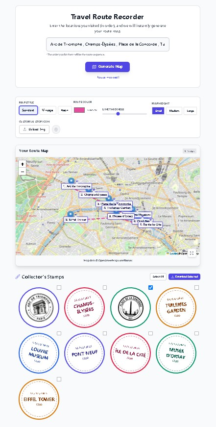

# Travel Route Recorder 🌍✈️

**Travel Route Recorder** is an interactive web application designed to transform simple text itineraries into beautiful, visual travel memories.

Powered by **Google Gemini 2.5 Flash** and **Imagen 3**, this tool intelligently geocodes your travel stops, plots them on a customizable interactive map, and generates unique, artistic "passport stamps" for every location you visit.

## ✨ Key Features

- **📍 AI Geocoding:** Instantly converts loose text (e.g., "London, Paris, Rome") into a precise route map using Gemini 2.5 Flash.
- **🎨 Custom Map Styles:** Toggle between Standard, Vintage, and Neon map aesthetics with customizable route colors.
- **🖼️ AI Stamp Generation:** Create one-of-a-kind digital passport stamps for your stops using generative AI (Imagen 3).
- **🖌️ Custom Map Icons:** Upload photos to generate minimalist vector map icons via AI analysis.
- **💾 Export & Save:** Download high-resolution map images, individual stamps, or save your entire trip history to JSON.

## 🛠️ Built With

- **Framework:** Angular (v21+)
- **Styling:** Tailwind CSS
- **Maps:** Leaflet.js
- **AI:** Google GenAI SDK (Gemini 2.5 Flash & Imagen 3)

---

# Run and deploy your AI Studio app

This contains everything you need to run your app locally.

View your app in AI Studio: https://ai.studio/apps/drive/1hqtUavTHFx0Y2Is56j_AzvC3rE3-GoKv

## Run Locally

**Prerequisites:**  Node.js

1. Install dependencies:
   `npm install`
2. Set the `GEMINI_API_KEY` in [.env.local](.env.local) to your Gemini API key
3. Run the app:
   `npm run dev`
